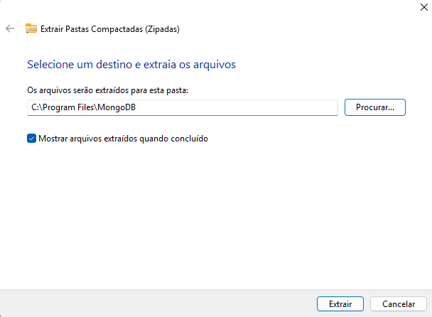
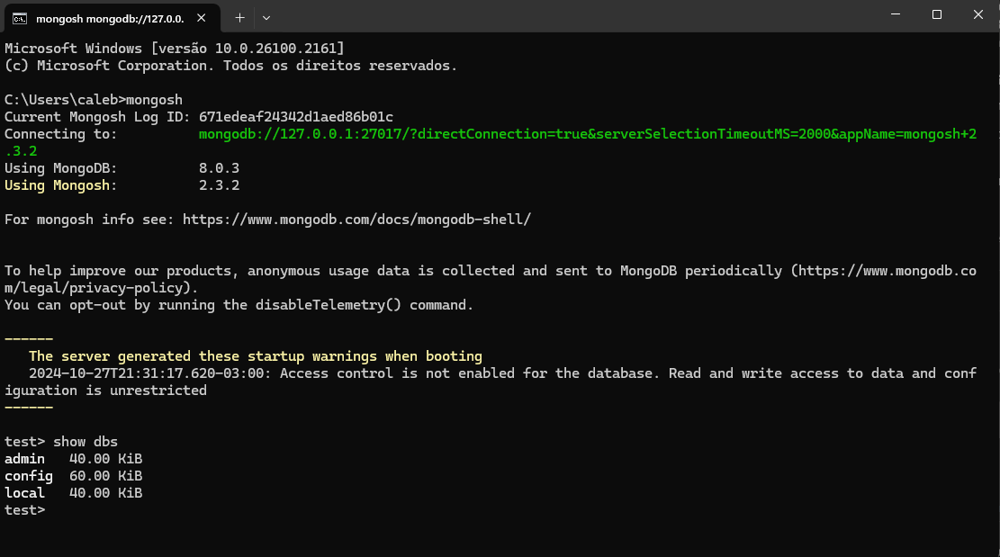
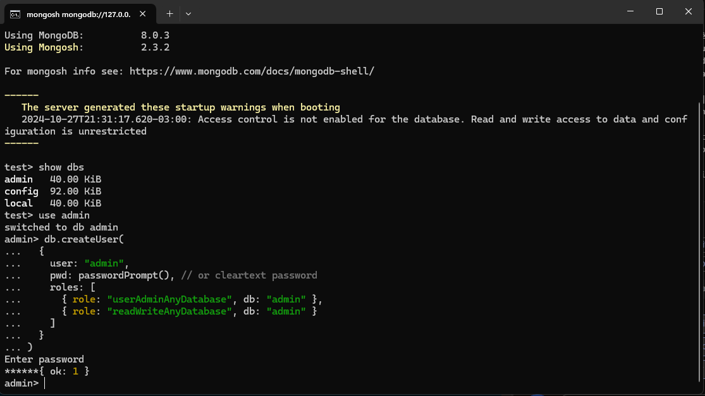
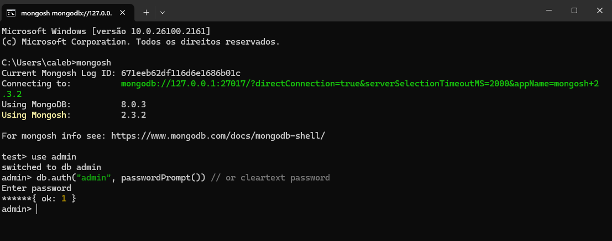
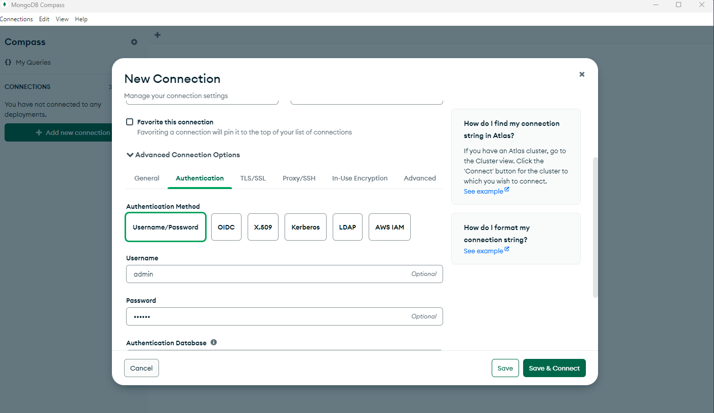
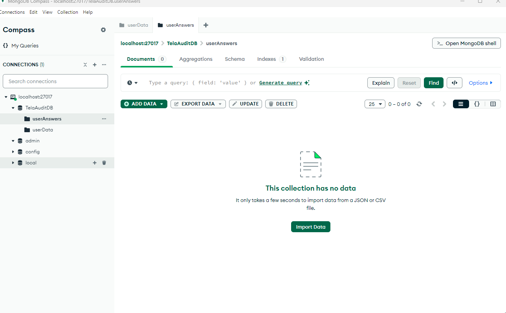
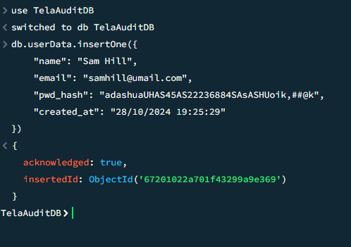

# CheckList ABNT NBR ISO 9241-11:2021

Trabalho de Graduação do curso Analise e Desenvolvimento de Sistemas, da faculdade Estadual Fatec Arthur de Azevedo.

## Inicializando o backend

Entre na pasta mova seu terminal para pasta app
Execute o comando no bash: ```python -m venv .venv```
Para habilitar o ambiente virtual, no bash execute dentro da pasta website ```source .venv/Scripts/activate```
Após habilitar o ambiente virtual, execute o comando ```python.exe -m pip install --upgrade pip``` para atualizar o pip
Após atualizar o ambiente pip, execute o comando no bash ```pip install -r requirements.txt``` para realizar o download das dependencias.

### Inicializando o servidor
Utilize o comando no bash ```flask --app server run``` este comando irá habilitar o servidor local host

### Inicializando o servidor modo debug
Utilize o comando no bash ```flask --app server run --debug``` este comando irá habilitar o servidor local host no modo debug.

## Banco de dados

### Instação
Utilizamos o banco de dados MongoDb neste aplicação. 
- Você pode fazer o download neste link: https://fastdl.mongodb.org/windows/mongodb-windows-x86_64-8.0.3-signed.msi
- MongoDB Shell: https://downloads.mongodb.com/compass/mongodb-compass-1.44.5-win32-x64.exe

Faça primeiro a instalação do MongoDB padrão. Ao instalar com sucesso, faça o download do MongoDB Shell, e extraia os arquivos dentro da pasta de instalação do MongoDB.



### Configuração & Autenticação
Vá na sua barra de pesquisa do windows e procure por Variáveis de ambiente -> Variáveis do sistema -> clique em Path -> Editar -> Novo -> Procure o caminho da pasta **bin** dentro da pasta extraída do MongoDB Shell.

Após a configuração das variáveis de ambiente, abra o prompt de comando e digite ```mongosh```:



Digite o código abaixo para definir um administrador geral para o banco de dados, onde posteriormente iremos criar conexões e usaremos permissões para criar
```
use admin
db.createUser(
  {
    user: "admin",
    pwd: passwordPrompt(), // or cleartext password
    roles: [
      { role: "userAdminAnyDatabase", db: "admin" },
      { role: "readWriteAnyDatabase", db: "admin" }
    ]
  }
)
```


Abra o arquivo **mongod.cfg** dentro da pasta ```Server/<versao>/bin```, e mude a configuração para habiliantando a autenticação.
```
security:
    authorization: enabled
```


Pare a execução do banco de dados e feche o prompt de comando.
Após isso abra novamente o prompt de comando e execute o comando ```mongosh``` novamente, logo após entre o comando para realizar a autenticação do banco do banco como admin.

```
use admin
db.auth("admin", passwordPrompt()) // or cleartext password
```


- Caso seja necessário, aqui está a documentação oficial para criar autenticação: [https://www.mongodb.com/pt-br/docs/manual/tutorial/configure-scram-client-authentication/](https://www.mongodb.com/pt-br/docs/manual/tutorial/configure-scram-client-authentication/)

### Criando nova base para o projeto

Abra o MongoDB Compass para melhor visualização da criação das collections, e clique em **Add new connection**. 
Clique em **Advanced Connection Options -> Authentication -> Username/Password**, entre seu usuário e senha de conexão com o mongodb e clique em **Save & Connect**.



Após feito a conexão, crie uma nova **database**, e adicione duas collections necessárias de acordo com o diagrama.




### Inserindo os modelos nas bases

Olhe na pasta de documentação, e procure o json com o nome de cada **collection**, e execute no prompet do mongo compass, repitindo o processo pras demais collections.



